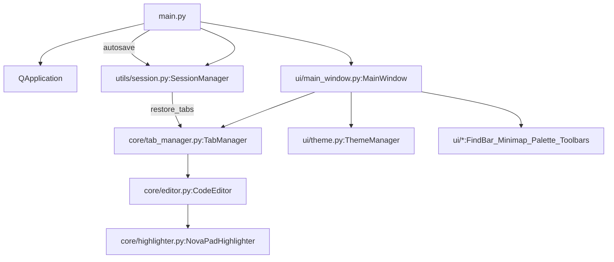

# NovaPad architecture (high-level)

NovaPad is a **Windows-first PyQt6** desktop editor. Conceptually it’s:

- **`main.py`**: process entry + crash/update/session orchestration
- **`ui/main_window.py`**: the “composition root” that assembles widgets + actions
- **`core/`**: the editor (`CodeEditor`), tabs (`TabManager`), and syntax highlighting
- **`utils/session.py`**: crash-safe session persistence (tabs, buffers, cursor/scroll)
- **`ui/theme.py` + `ui/theme_picker.py`**: theme tokens + QSS/palette + picker/transition UI

## Module map (what lives where)

### Top-level
- **`main.py`**
  - HiDPI env setup, crash logging (`crash.log`)
  - Crash detection via session lock
  - CLI arg file open (`NovaPad.exe file1.txt file2.py`)
  - Update check (GitHub releases) + silent in-place update via installer
  - Debounced + periodic session autosave

- **`requirements.txt`**
  - Runtime dependencies are essentially **PyQt6** (plus Qt6 + sip).

### `core/` (editor engine)
- **`core/editor.py`**
  - `CodeEditor(QTextEdit)`: the primary editing widget
  - “Dual-mode” concept: **code** vs **rich**
  - Line numbers gutter (`LineNumberArea`) and drawing logic
  - Timestamp lines: protected, theme-aware, survive save/restore
  - Core text-editing affordances: indent/unindent, duplicate line, toggle comment, smart home
  - Multi-cursor (Alt+click) with custom cursor rendering
  - Zoom model: emits `zoom_step(int)` for Ctrl+Wheel; MainWindow applies zoom

- **`core/tab_manager.py`**
  - `TabManager(QTabWidget)`: owns tabs and emits app-level signals
  - `NovaPadTabBar(QTabBar)`: custom painted tabs, “+” button, close buttons, drag reorder, inline rename
  - `EditorTab(QWidget)`: small container that owns a single `CodeEditor`

- **`core/highlighter.py`**
  - `NovaPadHighlighter(QSyntaxHighlighter)`: token rules + block-state machine for multi-line constructs
  - Language selection is driven by `CodeEditor` (`file_path` setter / sniffing) and mode

### `ui/` (composition + user-facing features)
- **`ui/main_window.py`**
  - Creates and wires:
    - `TabManager` (editor tabs)
    - `FindBar` (find/replace)
    - `Minimap`
    - `FormatToolbar` (rich text B/I/U)
    - `GotoLineBar`
    - `BookmarkManager`
    - `CommandPalette`
  - Owns `QSettings("NovaPad","NovaPad")` for persistent UI settings (theme, geometry, toggles, recents).
  - Centralizes QAction shortcuts to avoid conflicts (and uses `QShortcut` for F3/Shift+F3).

- **`ui/theme.py`**
  - `THEMES`: token dictionary per theme
  - `ThemeManager.apply(app, name)`: builds QSS and applies palette
  - `apply_titlebar_color(...)`: Windows DWM caption/border/text (Win11 build 22000+) + immersive dark mode; optional via `titlebar.match_windows_dwm` QSettings (default true)
  - Gradient themes: only override QToolBar QSS so custom-painted tab bar remains stable

- **`ui/theme_picker.py`**
  - `ThemePicker`: popup theme selection UI with swatches
  - `ThemeTransitionOverlay`: crossfade transition by screenshot overlay

- **`ui/find_bar.py`**
  - Find/replace UI with live highlighting via `QTextEdit.ExtraSelection`
  - Skips timestamp blocks when searching/replacing
  - Emits match block numbers to minimap + scrollbar overlay tick marks

- **`ui/minimap.py`**
  - Renders a cached scaled view of the `QTextDocument` (pixmap cache)
  - Draws viewport indicator based on the editor vertical scrollbar ratio
  - Draws search ticks and bookmark ticks
  - Allows click/drag scrolling by inverting the viewport-box math

- **`ui/scrollbar_overlay.py`**
  - Transparent widget over the editor vertical scrollbar that paints search ticks

- **`ui/format_toolbar.py`**
  - Formatting toolbar for rich mode only (Bold/Italic/Underline)
  - Watches `CodeEditor.cursor_format_changed` + `CodeEditor.mode_changed`

- **`ui/goto_line.py`**
  - Lightweight go-to-line bar; jumps to a block number and briefly flashes selection

- **`ui/bookmarks.py`**
  - Bookmark state is stored per-editor (keyed by `id(editor)`) as a set of block numbers
  - Gutter/minimap read bookmark state to paint indicators

- **`ui/command_palette.py`**
  - Fuzzy-filterable list of all menu actions; activated with Enter

- **`ui/dialogs.py`**
  - Themed message/progress/about dialogs used across the app (including crash restore prompt and update UI)

### `utils/`
- **`utils/session.py`**
  - Crash-safe session persistence (metadata + optional temp buffers for unsaved/modified tabs)
  - Uses an atomic-write strategy to avoid partial files on power loss

## Core runtime flow

### Startup and restore rules (`main.py`)
- **Crash detection**: `SessionManager.was_crash()` checks for `running.lock`.
- **Lock marker**: `SessionManager.mark_running()` creates `running.lock` early; `mark_clean_exit()` removes it on clean exit.
- **CLI files win**: if paths are passed on the command line, NovaPad opens those and does not prefer prior session state.
- **Restore behavior**:
  - normal launch: `session.restore(window)` silently
  - after crash: themed prompt; restore or discard

### Session persistence (what gets saved)
Session metadata includes:
- active tab index
- per-tab label
- file path (if any)
- modified flag
- cursor line/col
- vertical scroll position
- optional temp file pointer (for unsaved/modified tabs)

**On Windows, session files live under** `%APPDATA%\\NovaPad\\session\\`:
- `session.json`
- `running.lock`
- `tabs\\<id>.txt` (temp buffers for unsaved/modified tabs)

### Settings persistence (theme, geometry, toggles)
NovaPad uses **Qt `QSettings("NovaPad","NovaPad")`** (registry-backed on Windows) for UI preferences:

- Theme: `theme`
- Word wrap: `word_wrap`
- Line numbers: `line_numbers`
- File autosave (writes real files periodically): `auto_save`
- Minimap visible: `minimap`
- Window geometry: `win_w`, `win_h`, `win_x`, `win_y`, `win_maximized`
- Recent files list: `recent_files`

This is intentionally separate from the crash-safe session store (`utils/session.py`), which is file-based under AppData.

## Editor architecture (`core/editor.py`)

### `QTextEdit` and “dual mode”
`CodeEditor` subclasses **`QTextEdit`** to support:

- **Code mode**
  - `setAcceptRichText(False)` and uses a monospace code font
  - Syntax highlighting enabled (`NovaPadHighlighter.set_language(...)`)
  - Word wrap defaults off (but can be toggled by MainWindow)

- **Rich mode**
  - `setAcceptRichText(True)`
  - Syntax highlighting is effectively disabled by setting language `"plain"`
  - Formatting toolbar features are enabled (B/I/U); paste is overridden to strip external fonts

Mode is chosen by file extension via the `file_path` setter:
- “code-like” extensions → code mode
- everything else → rich mode
If there is no extension, the editor can **sniff language** based on early content and switch into code mode.

### Timestamp lines (protected blocks)
Timestamps are implemented as **tagged `QTextBlock` blocks**:

- A timestamp block is identified by `QTextBlock.userData()` being `_TimestampData`.
- They’re protected by key handling:
  - edits are blocked while the cursor is on a timestamp block
  - backspace at the start of the line below a timestamp deletes the timestamp block cleanly
- They are **theme-aware** (`gutter_fg`) and re-colored on theme changes.

#### Persistence strategy
Because `QTextBlockUserData` is not persisted in plain text, NovaPad injects a **private sentinel prefix** into saved text:

- `_TS_SENTINEL = U+E000 + "NOVAPAD_TS" + U+E000`
- On load, lines with the sentinel are reconstructed as timestamp blocks.

This is why timestamps survive:
- saving to disk (`get_content_for_save`)
- crash-safe session restore (`SessionManager.save/restore`)

### Line numbers (gutter)
Line numbers are a separate widget (`LineNumberArea`) that calls back into `CodeEditor` to paint:

- line numbers for visible non-timestamp blocks
- a clock icon for timestamp blocks
- bookmark dots (via `editor._bookmark_manager`)

## Tabs and lifecycle (`core/tab_manager.py`)

### Ownership model
- `QTabWidget` owns `EditorTab(QWidget)`
- each `EditorTab` owns exactly one `CodeEditor`

This keeps tab close/reorder at the container-widget level and avoids editor lifetime surprises.

### Signals that drive the rest of the app
`TabManager` emits:
- `tab_changed(editor)`
- `title_changed(label)`
- `modification_changed(bool)`

`MainWindow` listens to these to:
- update the window title
- re-attach `FindBar`, `Minimap`, and toolbars to the active editor
- propagate settings to the active editor

### Custom tab bar behavior
`NovaPadTabBar` replaces Qt’s look with custom painting and adds:
- “+” button → `new_tab_requested`
- close buttons → `close_tab_requested(index)`
- inline rename overlay → `rename_tab_requested(index, new_label)`
- drag reorder with animated shifts; commits by calling parent `TabManager._move_tab(src, dst)`

## Supporting widgets (integration highlights)

### Find & Replace (`ui/find_bar.py`)
FindBar uses `QTextDocument.find(...)` and paints matches via `QTextEdit.ExtraSelection`.
Key integration points:

- Skips timestamp blocks (`_is_timestamp_block`) so protected lines don’t get altered.
- Emits match block numbers to:
  - `Minimap.set_search_lines([...])`
  - `ScrollbarOverlay.set_search_lines([...], n_total_lines)`

### Minimap (`ui/minimap.py`)
Minimap is a **scaled document renderer**:

- renders the document into a pixmap cache by scaling the painter and calling `QTextDocument.drawContents`
- computes viewport box from the editor scrollbar’s `value/pageStep/maximum`
- draws search highlights + bookmark ticks based on stored block numbers
- click/drag scroll maps y-position back to scrollbar value

### Format toolbar (`ui/format_toolbar.py`)
The format toolbar is intentionally lightweight:

- only enabled in rich mode
- tracks editor state via `cursor_format_changed` and `mode_changed`

### Command palette (`ui/command_palette.py`)
The palette is populated by `MainWindow._show_palette()` which harvests all menu actions and exposes them as runnable commands.

## Update mechanism (distribution-aware)
NovaPad can self-update via GitHub releases:

- `main.py` checks the latest GitHub release tag off-thread.
- If a newer `.exe` asset is found, it downloads the installer to `%TEMP%`.
- It writes a batch script that runs the installer silently and relaunches NovaPad using App Paths registry lookup (fallback to `%ProgramFiles%\\NovaPad\\NovaPad.exe`).

This update flow triggers a session save (`session.save(window)`) before closing so tab state can restore after the upgrade.

## Build & distribution pipeline (Windows)
- **PyInstaller**: bundles into `dist/NovaPad/` (one-folder / onedir).
  - includes `assets/`
  - includes hidden-import `PyQt6.QtSvg` (needed for SVG rendering)
- **Inno Setup**: wraps the `dist/NovaPad/` folder into a standard Windows installer.

See:
- `novapad.spec`
- `build.bat`
- `installer/novapad_setup.iss`
